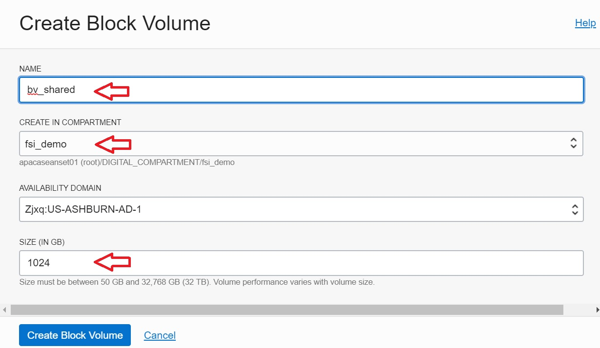
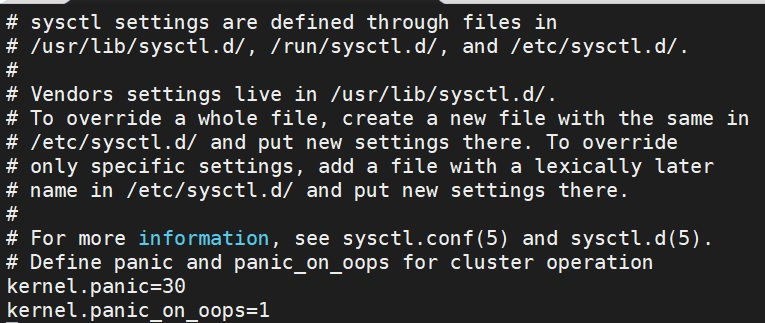
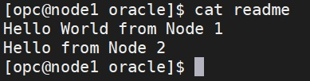

## Adding Shared Block Storage to Multiple Computes in OCI

This guide explains how to add shared block storage with READ/WRITE access to multiple computes in OCI. If you are looking for adding a dedicated block storage to OCI instead, please refer to [here](add_block_storage_to_oci.md).  

The steps below are based on the blog https://blogs.oracle.com/cloud-infrastructure/using-the-multi-attach-block-volume-feature-to-create-a-shared-file-system-on-oracle-cloud-infrastructure with necessary customization to make sure it's easier to follow and matching OCI Gen 2 environments so that folks that is new to shared file system details can quickly set it up on OCI Gen 2.  

The target architecture we are going to setup as follows from the blog above:  

### Pre Requisites

Before using this guide, you need to provide at least two of the nodes above. The guide will assume you have two nodes called 'node1' and 'node2', and you have identified the private IP of both nodes from /etc/hosts.  At the same time, the guide assumes you have sufficient security access (IAM Policy) to manage block storage in your Oracle Cloud Account. For more details on IAM Policy required, please refer to the official document https://docs.cloud.oracle.com/en-us/iaas/Content/Block/Tasks/attachingvolumetomultipleinstances.htm#configcluster and get your administrator to grant the necessary rights if you don't already have it.

### Detailed Steps

#### Step 1: Create Block Volume To Be Shared

* Login to Oracle cloud console http://cloud.oracle.com and login with your username and password
* Click on the burger icon on top left hand corner and select Block Storage -> Block Volume

  

* Click on 'Create Block Volume'

  

* Specify a name for the block volume, e.g., bv_shared. Choose the same compartment where the two compute node node1 and node2 are located, and customize the storage size if necessary, and click on 'Create Block Volume'

  

* Wait for provisioning to complete

#### Step 2: Attached Block Volume to Compute & Run iSCSI Commands

* Once provisioning is completed, scroll down to click on 'Attached Instances'

  

* Click on 'Attach to Instance'

  

* Leave the attachment type as default iSCSI, and specify access type as READ/WRITE - SHARABLE, and tick the checkbox for warning message

  

* Select the compute 'node1' from the instance dropdown box and select a new device name, e.g., /dev/oracleoci/oraclevdb (If oraclevdb is in use, pick a new name), and click 'Attach'

  

* Close the reminder message

  

* Repeat the same steps to attach the same block volume to node 2. After attach, you will see both nodes under the attached instances list for the block volume bv_shared. For simplicity, make sure you choose the same device name as node 1.

  

Click on the list icon as shown above for node 1

* From the pop-up menu, select 'iSCSI Commands & Information'

  

* Copy the attach command by clicking 'Copy' under 'Attach Commands'

  

* Open SSH console to node 1 and login as opc, run the above commands (Make sure press enter again after copy & paste to command to ensure all commands are executed):

  

Repeat Step 2 again for node 2

### Step 3: Open Ports

* SSH to node 1 and login as opc
* Disable selinux by editing the config file:  

sudo vi /etc/selinux/config  

Change SELINUX to disabled as shown

  

* Repeat the same for node 2 to disable selinux  

* Now we will open port for OCFS2

* From Oracle Cloud Console showing the list of attached instances under block volume, click on 'node 1'

  

* Click on the subnet under Primary VNIC

  

* Click on the default security list

  

* Right click on the name of VCN and open in a new tab to review VCN details

  

* Write down the CIDR block info as shown. In this example, the CIDR block is 10.0.0.0/16

  

* Go back to Security list tab in your browser and Click on 'Add Ingress Rule'

  

* Specify Source CIDR using the CIDR info from VCN (so that this rule only apply to computes within the current internla network and not public network), and specify no destination port so that all ports are open. Click on 'Add Ingress Rule'. If you have concern on opening too many ports, please specify destination port as '7777,3260'

  

* You also need to open firewall rules within node 1 and node 2. To do this, login to both node 1 and node 2 via SSH, login with opc and run the following commands **[IMPORTANT] DO NOT FORGET THIS STEP**:  

sudo firewall-cmd --zone=public --permanent --add-port=7777/tcp  
sudo firewall-cmd --zone=public --permanent --add-port=3260/tcp  
sudo firewall-cmd --complete-reload  

  

#### Step 4: Setup OCFS2

OCFS2 (https://en.wikipedia.org/wiki/OCFS2) is a shared disk file system to coordinate access to shared disk so as to prevent corruption. We must set it up before using the shared block volume or risk file corruptions.  

In this step, we install OCFS2 and configure it on node 1 and node 2.  

* SSH to node 1 and login with user opc  

* Install the required OCFS2 packages by running:  

sudo yum install ocfs2-tools-devel ocfs2-tools -y  

  

* Generate OCFS2 configuration file by running:

sudo o2cb add-cluster ociocfs2  

* Check /etc/host to take note of the hostname and internal IP of node 1, and go to SSH console on node 2 to do the same and obtain the hostname and private IP of node 2. In my example, node 1 hostname is node1 and internal IP is 10.0.0.19 and node 2 hostname is node2 and internal IP is 10.0.0.20

  

* Define the nodes with the following command (DO NOT CHANGE THE SEQUENCE regardless of whether you are running it on node 1 and node2, this guide will be asking you to repeat the same steps for node 2 later)

sudo o2cb add-node ociocfs2 <node1_hostname> --ip <node1_private_ip>  
sudo o2cb add-node ociocfs2 <node2_hostname> --ip <node2_private_ip>  

E.g., in my environment, the command will be as shown below

  

* Verify the nodes are configured by running:  

sudo cat /etc/ocfs2/cluster.conf  

You should see both nodes configured as follows (note that this file should be identical in node 1 and node 2:  

  

* Next we configure the Cluster Stack

sudo /sbin/o2cb.init configure  

Specify 'Load O2CB driver on boot' as yes, and ensure that 'Cluster to start on boot' is 'ociocfs2', accept default for others:

  

* Verify the result:  

sudo /sbin/o2cb.init status  

  

DO NOT worry abuot O2CB heartbeat as we have not mount yet.  

* Configure the o2cb and ocfs2 services so that they start at boot time after networking is enabled  

sudo systemctl enable o2cb  
sudo systemctl enable ocfs2  

  

* Set recommended kernel parameters

sudo sysctl kernel.panic=30  
sudo sysctl kernel.panic_on_oops=1  

  

* To make the change persist across reboots, add the following entries to the /etc/sysctl.conf file  

Run: sudo vi /etc/sysctl.conf  

Add this block:  

\# Define panic and panic_on_oops for cluster operation  
kernel.panic=30  
kernel.panic_on_oops=1  

  

* More commands on managing the cluster stack can be found in the blog above. You don't need those command for this setup, it's just for your reference.  

* Now repeat all the above under Step 4 to perform the same on node 2.

#### Step 5: Mount Block Volume To Local File System

* Create OCFS2 volume on node 1. Note that this step just need to be performed once on node 1 and DO NOT do the same for node 2 as it already created the volume on the shared block volume.

sudo mkfs.ocfs2 -L "ocfs2" /dev/oracleoci/oraclevdb  

  

* **[For node 1 and node 2]** Create a local directory to be mount on and mount to /dev/oracleoci/oraclevdb

sudo mkdir /u01  
sudo mount /dev/oracleoci/oraclevdb /u01  

* **[For node 1 and node 2]** Update fstab

sudo vi /etc/fstab  

And add these lines:  

#include the below line to mount your ocfs2 after a restart  
/dev/oracleoci/oraclevdb /u01 ocfs2     _netdev,defaults   0 0  

  

* We have now setup the shared block volume between node 1 and node 2. You can use 'df -h' to verify the storage allocation is correct.

  

#### Step 6: Testing & Demo

* To make sure the shared block volume works, this section will explain how to create a directory and file from node 1, review the file from node 2, modify the file in node 2 and confirm the changes in node 1. For advanced users, please proceed to test it without following this guide.  

* Create file in node 1:  

sudo mkdir /u01/oracle  
sudo chown opc:opc /u01/oracle  
echo "Hello World from Node 1" > /u01/oracle/readme  

  

* Verify the file content in node 1 as well as node 2:

cat /u01/oracle/readme  

  

* After verify the file content from node 2, open the file in node 2 with 'vi /u01/oracle/readme', and change the file content as you wish. For example, the demo will change the file content as follows:

  

* Go back to node 1 and check if you see the same content:

cat /u01/oracle/readme  

  

* Congratulations, the shared storage is working!

