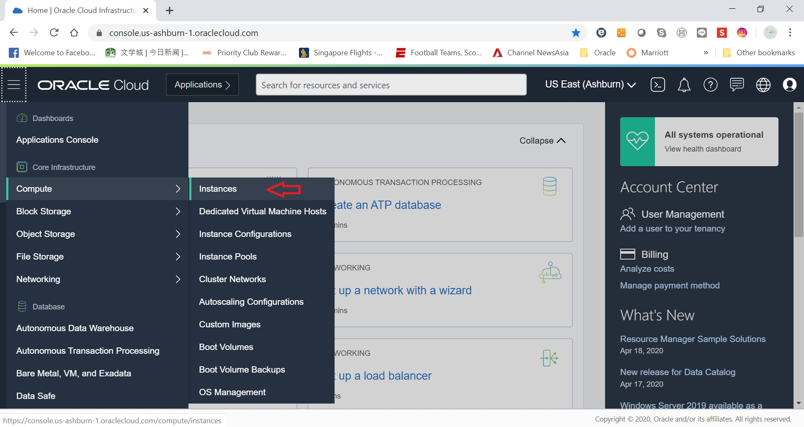

# How to Schedule Stop/Start for OCI Compute

Sometimes we want to only use OCI Compute for certain hours of the day and would like to stop the compute outside working hour to optimize cloud investments. This guide explains how you can schedule stop/start of OCI compute. Should you want to perform adhoc stop/start of OCI compute, the easiest way is to use Oracle Cloud Console GUI. This guide explains how to schedule the same task via crontab.

## Overview

Stop/Start OCI Compute can be done via either Oracle Cloud Console GUI or OCI CLI (Command Line Interface). While it's the easiest to perform these task via Cloud Console GUI, scheduling require CLI instead.  

We can either hose the OCI CLI on a small OCI Compute itself, or runs on a Windows Server locally, or a UNIX Server locally. This guide assumes you are running it on a small OCI compute. If you are running on Windows, simply refer to the part about OCI CLI details in this guide, and register the stop/start script with Windows Task Scheduler. For local UNIX, you can skip the part of provisioning OCI Compute in this guide and follow the rest of the steps.  

## Pre-Requisite

You need to have a Oracle OCI Gen 2 account with sufficient credit to provision for the additional compute of 1 OCPU. We are going to use this compute purely for the purpose of scheduler and thus doesn't require much computing power.

## Detailed Steps

### Step 1: Provision OCI Compute for Scheduler

* Login to Oracle Cloud Console from http://cloud.oracle.com and login with your tenancy ID and login credentials
* Click on the burger icon on the top left hand corner and select Compute -> Instances

