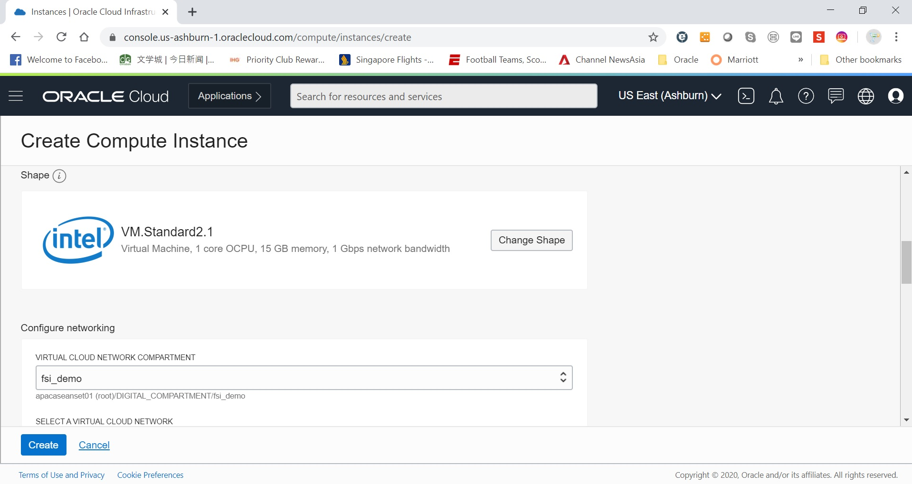
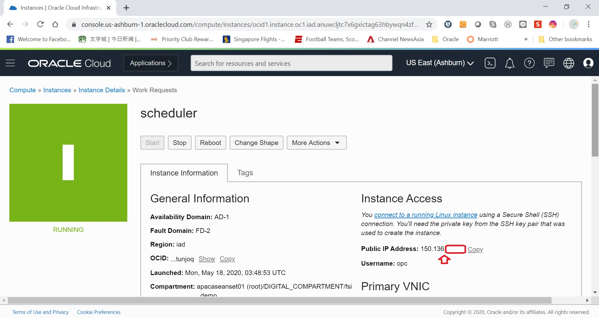

# How to Schedule Stop/Start for OCI Compute

Sometimes we want to only use OCI Compute for certain hours of the day and would like to stop the compute outside working hour to optimize cloud investments. This guide explains how you can schedule stop/start of OCI compute. Should you want to perform adhoc stop/start of OCI compute, the easiest way is to use Oracle Cloud Console GUI. This guide explains how to schedule the same task via crontab.

## Overview

Stop/Start OCI Compute can be done via either Oracle Cloud Console GUI or OCI CLI (Command Line Interface). While it's the easiest to perform these task via Cloud Console GUI, scheduling require CLI instead.  

We can either hose the OCI CLI on a small OCI Compute itself, or runs on a Windows Server locally, or a UNIX Server locally. This guide assumes you are running it on a small OCI compute. If you are running on Windows, simply refer to the part about OCI CLI details in this guide, and register the stop/start script with Windows Task Scheduler. For local UNIX, you can skip step 1 and start with step 2

## Pre-Requisite

You need to have a Oracle OCI Gen 2 account with sufficient credit to provision for the additional compute of 1 OCPU. We are going to use this compute purely for the purpose of scheduler and thus doesn't require much computing power.

## Detailed Steps

### Step 1: Provision OCI Compute for Scheduler

* Login to Oracle Cloud Console from http://cloud.oracle.com and login with your tenancy ID and login credentials
* Click on the burger icon on the top left hand corner and select Compute -> Instances

* Click on 'Create Instance'

* Name the instance as 'scheduler' (You can use other names too) and accept the default image

* Accept the default shape as VM.Standard 2.1 as this only incur one CPU

* Make sure the compute is in your preferred compartment with the appropriate VCN and subnet. We are using a public subnet here so that later we can directly SSH to the instance. If you would like to keep in on a private subnet, you will need to setup Bastion host as a gateway to access the scheduler later. Detailed guide [here](https://github.com/yyeung13/bastion_host_demo/). For simplicity here, we use public subnet and create a public IP for this compute

* Ensure you have selected 'Assign Public IP Address'

* Provide a public key. If you need help with key pair generation, refer to https://www.oracle.com/webfolder/technetwork/tutorials/obe/cloud/javaservice/JCS/JCS_SSH/create_sshkey.html. If you are only testing/evaluating and do not want to create your own key pair, this guide also includes a demo key pair [here](keys/readme.MD)

  

Click on 'Create' to start provisioning the new compute.

* Once the compute is provision, take note of the public IP of the compute

  

* From Putty/MobaTerm, SSH to the compute with its public IP and the private key. This guide shows the configuration of MobaTerm

  

* Click on 'Session' icon as show above

  

* Click on 'SSH' and enter the public IP of the scheduler compute, and specify 'opc' as default username

  

* Under advanced SSH settings, provide the private key to login with

  

* Click on 'OK' to login, you should be able to login to the scheduler compute

  

### Step 2: Prepare Start/Stop Script

* We will put all scripts under a folder called 'scripts'. Run the following to create a directory called 'scripts' under user 'opc' home  

- mkdir scripts  
- cd scripts  

  

#### Step 2.1 Install OCI CLI

* Install OCI CLI (Command Line Interface)  

- bash -c "$(curl -L https://raw.githubusercontent.com/oracle/oci-cli/master/scripts/install/install.sh)"  
- You can accept default for all prompts during installation  

  

* After the installation, verify setup is correct by running  

- oci -v  

  

#### Step 2.2 Configure OCI CLI

* Now that you have installed OCI CLI, we need to configure OCI CLI to connect to your Oracle Cloud account. You will need your user OCID and tenancy OCID before we proceed  

* To get user OCID, from Oracle Cloud console, click on the profile icon on the top right hand corner and select 'User Settings'

  

* Copy user OCID by clicking 'copy' link and note down the user OCID

  

* To get tenancy OCID, from Oracle Cloud console, click on the profile icon on the top right hand corner and select 'Tenancy: <your_tenancy>'

  

* Copy tenancy OCID by clicking 'copy' link and note down the tenancy OCID

  

* From the SSH console to scheduler compute, run the following to configure OCI CLI

- oci setup config  
- Provide user/tenancy ID, region name (identify from Cloud Console) and choose default yes for the rest  

  

* Now we have to register the newly generated public key to Cloud Console. From the cloud console, use the profile icon on the top right hand corner and navigate to 'user settings' (We have done that earlier). Scroll down and select 'API Keys' -> 'Add Public Key':

  

The public key is in scheduler compute under ~opc/.oci/oci_api_key_public.pem. Copy the content and paste above. And click 'Add'

* To verify the setup of OCI is complete, run the following:

- oci iam region list --output table  

  

If you run into error running the above command, make sure you double check and ensure the API public key is registered with Oracle Cloud Console.  

- OCI configuration is now complete!

#### Step 2.3 Prepare Stop/Start Script

* While we can have one single script for stop/start, this guide make it easier by having separate script for stop/start. The syntax for stop is as follows:  

- oci compute instance action --action STOP --instance-id <vm-ocid> --wait-for-state STOPPED  

For start, it is as follows:  

- oci compute instance action --action START --instance-id <vm-ocid> --wait-for-state RUNNING  

* Create a script called startVM.sh under ~opc/scripts with the following start command above:  

- cd ~opc/scripts  
- vi startVM.sh  

Note that you need to add '. ~opc/.bash_profile' so that the script can load the environment variables when running in crontab later.  

  

VM OCID can be found on Oracle Cloud Console details view of the compute to be start/stop:  

  

Note: DO NOT use the same vm as scheduler to test as the script will be starting/stopping the VM.  

* Change permission of the script to be executable  

- chmod 755 startVM.sh  

And test the script by running (assume target VM is currently down):  

- ./startVM.sh  

  

Once started successfully, details of the VM will be shown as above. Note that the script will wait till the VM is fully started into RUNNING mode before exiting. However, do note that there are other possible result such as failure cases. If you want to cover those cases too, enhance the script to include possible failure too.  

* Follow similar steps to prepare stopVM.sh with the stop command above and test the stop script too:

  

* If you would like to stop/start multiple VMs, just add more stop/start commands to the script accordingly, following the order of stop/start you would prefer.  
* Now the scripts are ready!

#### Step 2.4 Configure Crontab for Scripts

* You can run the script any time you want manually. To ensure the script runs at specific timings automatically, you can add to crontab.  For example, we will demonstrate how to configure to auto start VM at 9AM everyday from Mon-Fri in this guide. You can follow the same approach to add more auto start/stop as you wish, by creating more stop/start scripts and register with crontab.  

* From the SSH console to scheduler compute, run:  

- crontab -e  

Configure the job as follows:  

- 0 9 * * 1,2,3,4,5 ~opc/scripts/startVM.sh >> ~opc/scripts/startVM.log 2>&1  

The above configures crontab to run the job every day at 9AM from Monday to Friday, run the start script and output the log to startVM.log. For details on crontab format, refer to https://oracle-base.com/articles/linux/cron-on-linux.  

  

- Save the crontab by entering ':wq'. The crontab is now created. Note that by default OCI Compute is using standard GMT, you will have to factor in this based on your local timezone.  

- After the crontab executes, you can review the output from startVM.log under ~opc/scripts  

- That's all you need to do to configure VM to start/stop automatically!

