# WebLogic 14c Installation on OCI Guide

## Pre-requisite

This guide assumes you have already provisioned OEL Compute on OCI and have SSH access to the environment

## Step 1: Download WebLogic Server Binary

- Secure Shell into OCI compute and login as opc, you should not need to enter password since we are using the generated private key
- Create a new directory under opc home called 'install', this folder should be accessable from /home/opc/install. (mkdir install)  

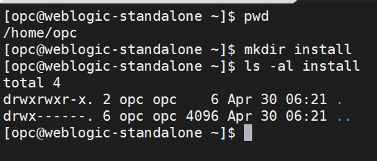  

- Download the generic installer for WebLogic Server 14c from https://www.oracle.com/middleware/technologies/fusionmiddleware-downloads.html, and put the file fmw_14.1.1.0.0_wls_Disk1_1of1.zip into the install folder as shown below:  

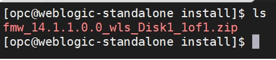  

## Step 2: Install Java

You can check the available JDK with the command: yum list jdk*, a sample output is as follows:  

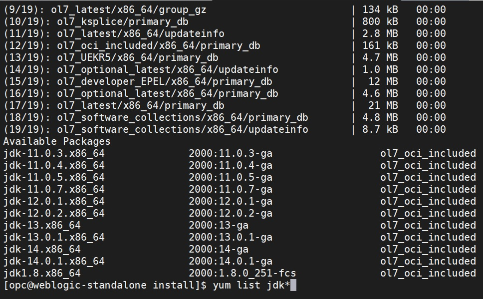  

We will install JDK 11 here, run the command: sudo yum install jdk-11.0.7  

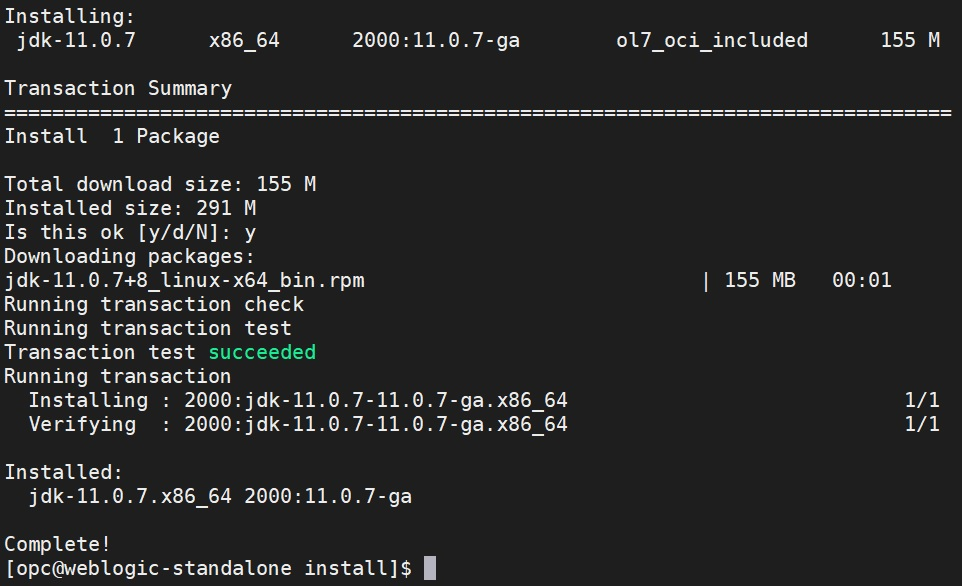  

Once installation complete, you can verify the Java version by running: java -version  

You should be able to see the follow  

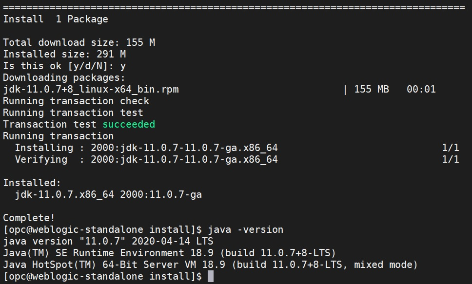  

## Step 3: Export Display from OCI

The easist way is to use MobaTerm (https://mobaxterm.mobatek.net/download.html). You can, however, use other ways such as VNC too. This guide will explain how to export display with MobaTerm. The rest of the guide assume you have MobaTerm installed locally (Home edition is sufficient)  

Run the following from SSH:  

- sudu su -
- cd /etc/ssh/
- vi sshd_config
- Search for the line that has X11UseLocalhost yes (it’s commented out).
- remove the comment from the beginning of the line and change the setting to no.
- Search for the line that has X11DisplayOffset (it’s commented out).
- remove the comment from the beginning of the line.
- save the file  

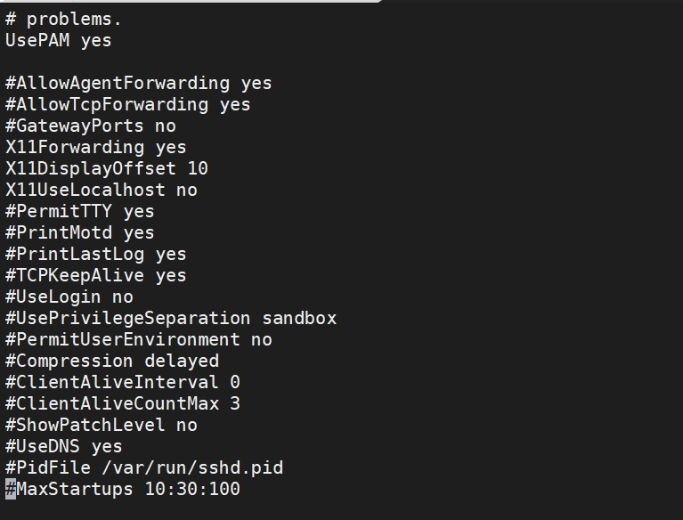  

- systemctl stop sshd.service
- systemctl start sshd.service
- systemctl enable sshd.service
- Install xauth & xterm: yum -y install xauth xterm
- Install Xtst: yum -y install libXtst.x86_64
- Exit root environment by running: exit
- Restart SSH session

- To verify the GUI export is working, you can install xclock and run xclock to test from SSH console

## Step 4: Extract WebLogic Installer

From install folder, run command: unzip fmw_14.1.1.0.0_wls_Disk1_1of1.zip  

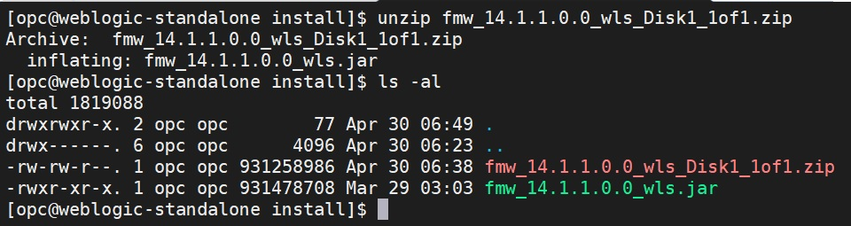  

Run the install by running command: java -jar fmw_14.1.1.0.0_wls.jar. You should see the follow:  

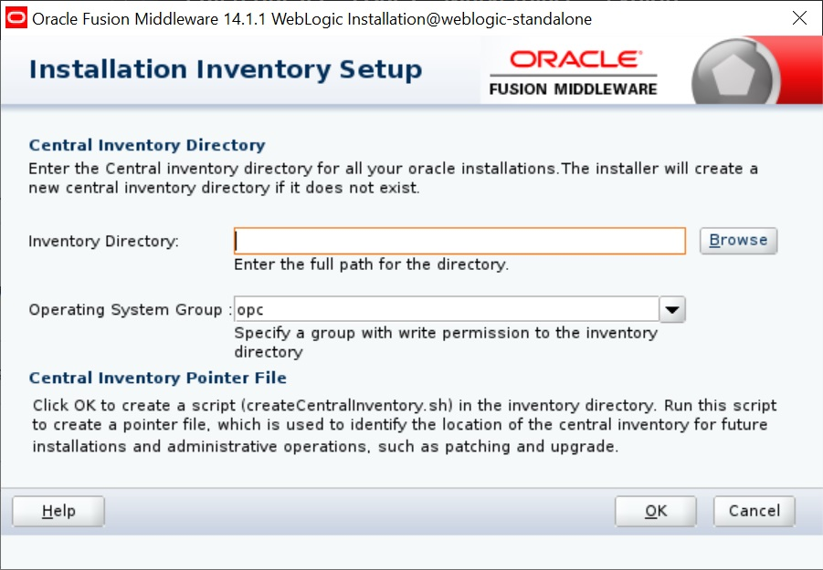  

Enter /home/opc/oraInventory as the inventory directory as follows:  

  

And click on OK:  

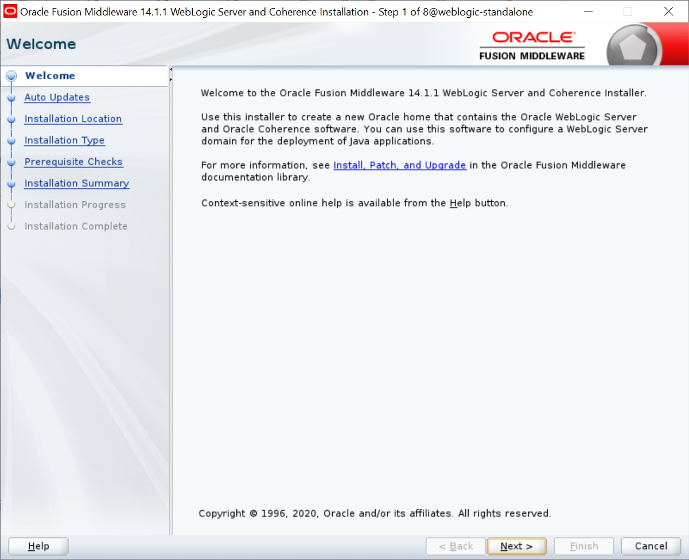  

Click 'Next':  

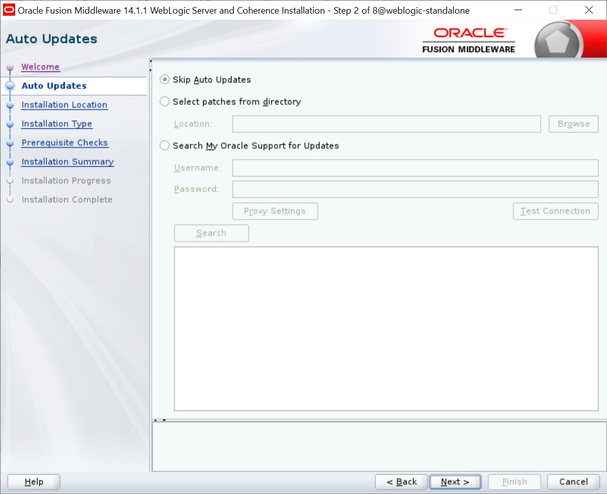  

Leave everything as default and click 'Next':  

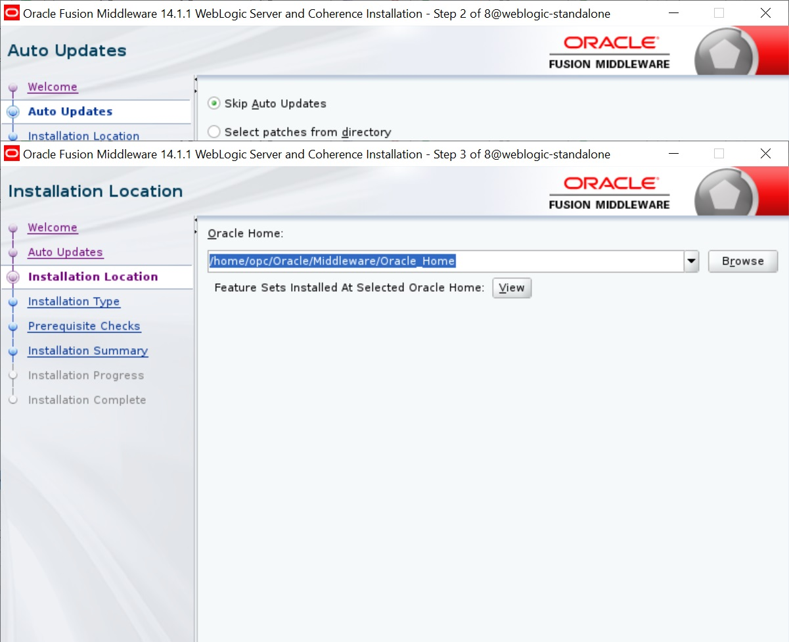  

Accept default home and click 'Next':  

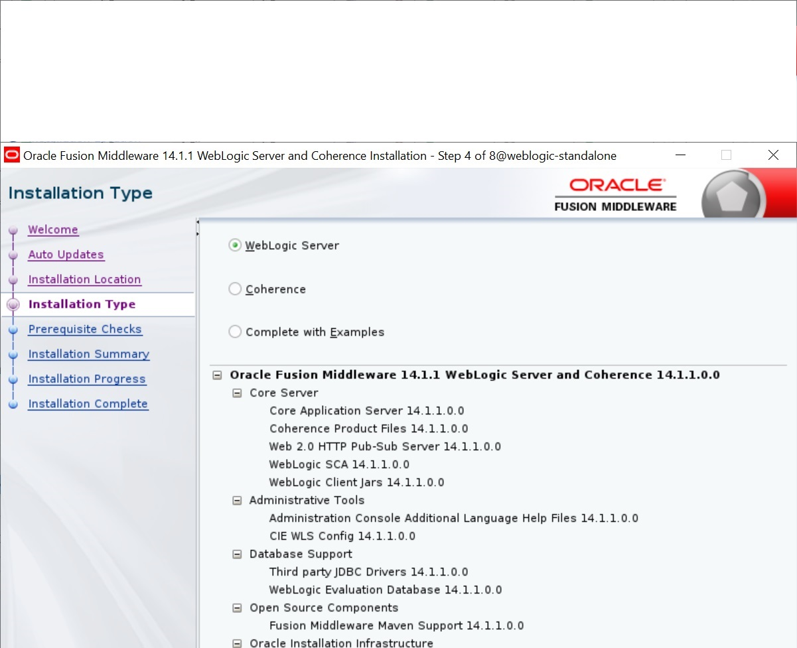  

Accept default installation choice and click 'Next'. -Pre-Installation check will start now. Please wait for it to complete:  

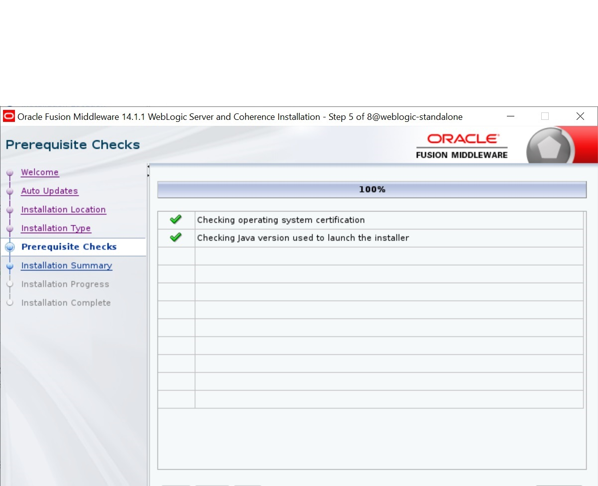  

Click 'Next' and 'Install' from Summary screen to start the installation process and wait for it to complete:  

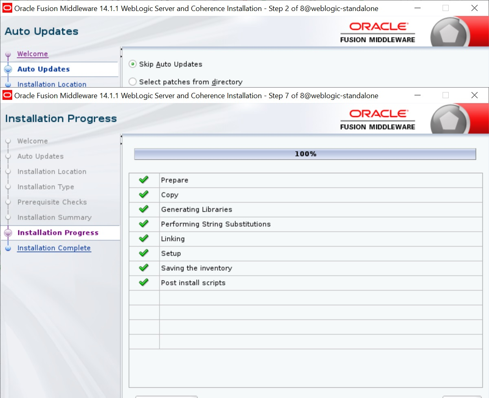  

Click on 'Finish' to complete the installation.  Now you have WebLogic installed on OCI. You can now proceed to create new domains with Domain Configuration Wizard.  

Thank you, should you encounter any problems, please feel free to drop me a note at y.yeung@oracle.com.
